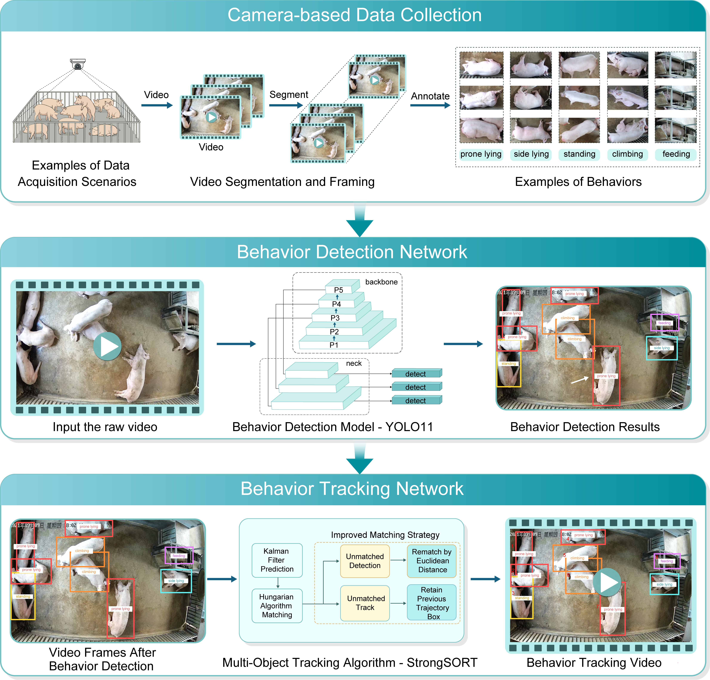

# 🐷 Pig Behavior Monitoring Dataset

The Pig Behavior Monitoring Dataset is an annotated resource designed to support the development and evaluation of computer-vision methods for automated monitoring of group-housed pigs in commercial barn environments. It comprises two complementary subsets: **Pig Multi-Behavior Detection**, which provides annotated images for five common pig behaviors—standing, side-lying, prone lying, climbing, and feeding—and **Individual Tracking**, which provides video sequences with frame-level identity annotations for tracking individual pigs over time. The dataset supports research on pig behavior detection and recognition, multi-object tracking, and individual-level analysis under practical farm conditions, including animal interactions, occlusion, and variable illumination.

## 🔎 Overview

<!-- A dataset overview figure will be added here. -->

## 📊 Dataset Summary

Detailed statistics for each subset—including the number of images, annotations, videos, frames, tracked identities, recording duration, and split counts—will be reported in the fixed Version 1.0.0 release.

## 🐖 Behavior Classes

The Pig Multi-Behavior Detection subset covers five primary behaviors:

1. Standing
2. Side-lying
3. Prone lying
4. Climbing
5. Feeding

The numerical class-ID mapping used in the annotation files will be included when the annotations are released.

## 🗂️ Directory Structure

```text
pig-behavior-monitoring-dataset/
├── pig_multi_behavior_detection/
│   ├── images/
│   │   ├── 000000000001.jpg
│   │   ├── 000000000002.jpg
│   │   └── ...
│   └── annotations/
│       ├── 000000000001.txt
│       ├── 000000000002.txt
│       └── ...
└── individual_tracking/
    ├── videos/
    │   ├── video1.mp4
    │   ├── video2.mp4
    │   └── ...
    └── annotations/
        ├── video1_GT.txt
        ├── video2_GT.txt
        └── ...
```

### 📁 Dataset Contents

**Pig Multi-Behavior Detection**

- `pig_multi_behavior_detection/images/` contains the image files.
- `pig_multi_behavior_detection/annotations/` contains the corresponding annotation files.

**Individual Tracking**

- `individual_tracking/videos/` contains the video sequences.
- `individual_tracking/annotations/` contains the corresponding tracking annotation files.

## ⚖️ License

This dataset is licensed under the [Creative Commons Attribution 4.0 International License (CC BY 4.0)](https://creativecommons.org/licenses/by/4.0/).

If you use this dataset, please provide appropriate attribution and cite the related dataset record and publication.

## 📝 Citation

If you use this dataset in your research, please cite:

```bibtex
@article{ShiPigBehaviorMonitoring,
    author    = {Wenhui Shi and Jusong Cao and Shengxin Wang and Jiawei Li and Yuhua Fu and Guoliang Li and Xuewen Xu and Xinyun Li and Haiyan Wang},
    title     = {Innovative Dual-Network Framework for Monitoring Multiple Behaviors of Individual Pigs in Group-Housed Environments},
    journal   = {},
    volume    = {},
    pages     = {},
    year      = {},
    issn      = {},
    doi       = {}
}
```

The bibliographic details will be completed when the associated article is formally published.

## 📌 Version and Availability

This repository is currently in preparation and contains documentation and directory placeholders only; the dataset files are not yet available for download. Version 1.0.0 will be released as a fixed GitHub version and archived as a Zenodo dataset record with a persistent DOI.

## ⬇️ Dataset Download

The stable dataset download link will be provided here when Version 1.0.0 is publicly released.

## 📬 Contact

- shiwenhui@webmail.hzau.edu.cn
- cjs@webmail.hzau.edu.cn
